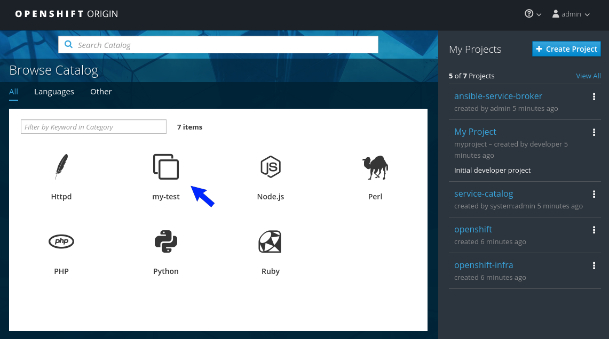
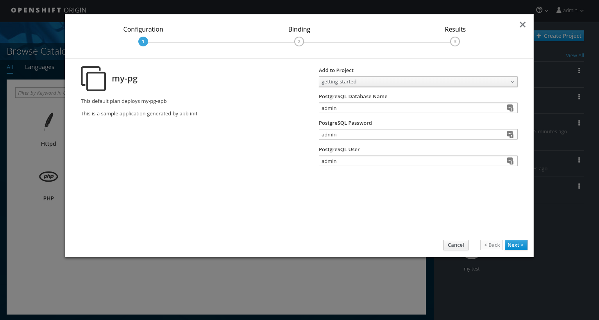
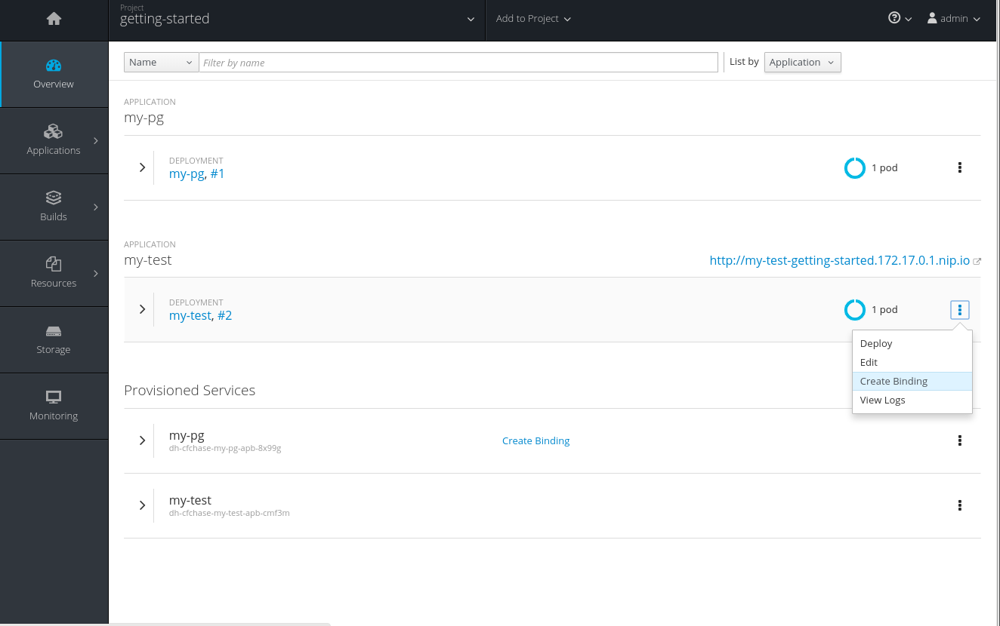
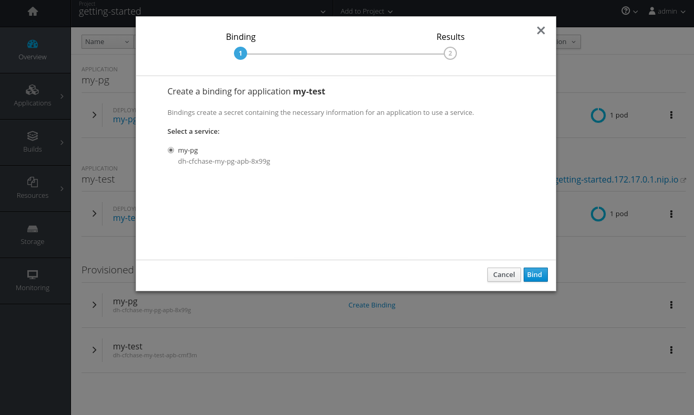
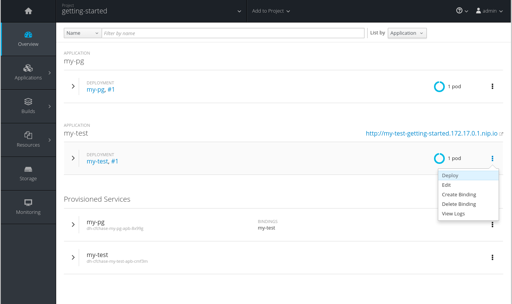
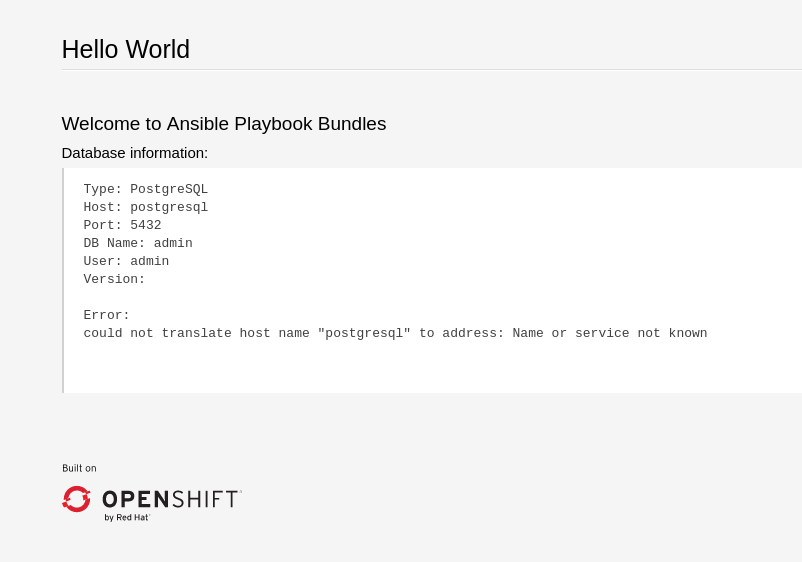

# Getting Started

1. [Introduction](#introduction-to-ansible-playbook-bundles-apbs)
1. [Development Environment](#development-environment)
1. [Creating Your First APB](#creating-your-first-apb)
    1. [Init](#using-apb-init)
    1. [Actions](#actions)
        * [Provision](#provision)
        * [Deprovision](#deprovision)
        * [Bind](#bind)
1. [More Information](#more-information)

## Introduction to Ansible Playbook Bundles (APBs)

In this tutorial, we'll walk through the creation of some sample APBs.  We will create actions for them to allow provision, deprovision, bind, and unbind.  You can find more information about the design of APBs in the [design doc](https://github.com/fusor/ansible-playbook-bundle/blob/master/docs/design.md).  

*Note:  For the remainder of this tutorial, substitute your own information for items marked in brackets, for example `<host>:<port>` might need to be replaced with `172.17.0.1.nip.io:8443`.*

## Development Environment

Before getting started with APBs, we need to get your system set up to create them.

First, make sure your system is properly running [OpenShift Origin](https://www.openshift.org/).  You should be able to successfully execute `oc cluster up`.  Instructions can be found on the OpenShift Origin [getting started doc](https://github.com/openshift/origin/blob/master/docs/cluster_up_down.md).

Next, install the APB tools as documented in the [README](https://github.com/fusor/ansible-playbook-bundle/blob/master/README.md#install).  To check, you can run `apb help` and check for a valid response.
```
$ apb help
usage: apb [-h] [--debug] [--project BASE_PATH]
           {init,help,prepare,push,bootstrap,list,remove,build} ...

APB tooling for assisting in building and packaging APBs.

optional arguments:
  -h, --help            show this help message and exit
  --debug               Enable debug output
  --project BASE_PATH, -p BASE_PATH
                        Specify a path to your project. Defaults to CWD.

subcommand:
  {init,help,prepare,push,bootstrap,list,remove,build}
    init                Initialize the directory for APB development
    help                Display this help message
    prepare             Prepare an ansible-container project for APB packaging
    push                Push local APB spec to an Ansible Service Broker
    bootstrap           Tell Ansible Service Broker to reload APBs from the
                        container repository
    list                List APBs from the target Ansible Service Broker
    remove              Remove APBs from the target Ansible Service Broker
    build               Build and package APB container

```

Then, create a local development environment with both a [Service Catalog](https://github.com/kubernetes-incubator/service-catalog) and [Ansible Service Broker](https://github.com/openshift/ansible-service-broker).  You can do this using [catasb](https://github.com/fusor/catasb), a collection of scripts which use Ansible to automate the set up of the cluster for you on a local host, ec2, or virtual machines.  For this tutorial we'll be assuming the locally hosted environment which is documented for [linux](https://github.com/fusor/catasb/blob/master/local/linux/README.md) and [mac](https://github.com/fusor/catasb/blob/master/local/mac/README.md).  After completing the set up, take note of the OpenShift cluster **host:port** output by the catasb Ansible scripts so you can login using the command line for the remainder of the tutorial.  It will look something like:

```bash
$ git clone https://github.com/fusor/catasb.git
$ cd catasb/local
$ ./reset_environment.sh

...

TASK [debug] *********************************************************************************************************************************
ok: [localhost] => {
    "msg": [
        "Hostname: <oc-cluster-host>",
        "Next steps:",
        "Visit https://<oc-cluster-host>:<oc-cluster-port> for the web console",
        "OR",
        "For CLI access:",
        "oc login --insecure-skip-tls-verify <oc-cluster-host>:<oc-cluster-port> -u admin -p admin",
    ]
}
```

## Creating your first APB
In this tutorial, we'll create an APB for a containerized [hello world application](https://hub.docker.com/r/ansibleplaybookbundle/hello-world/).  We'll work through a basic APB that will mirror the [hello-world-apb](https://github.com/fusor/apb-examples/tree/master/hello-world-apb) in the [apb-examples](https://github.com/fusor/apb-examples) project.

### Using apb init
Our first task is to create the skeleton for your app using the apb tool.  The command for this is simple:
```bash
$ apb init <my-org>/my-test-apb
```
At this point you will see the following file structure
```
my-test-apb/
├── apb.yml
├── Dockerfile
├── playbooks
│   ├── deprovision.yml
│   └── provision.yml
└── roles
    ├── deprovision-my-test-apb
    │   └── tasks
    │       └── main.yml
    └── provision-my-test-apb
        └── tasks
            └── main.yml
```
Two files were created at the root directory, an `apb.yml` and a `Dockerfile`.  These are the minimum required for any APB.  For more information, visit the [design doc](https://github.com/fusor/ansible-playbook-bundle/blob/master/docs/design.md).
```yaml
# apb.yml
name: my-test-apb
image: <my-org>/my-test-apb
description: This is a sample application generated by apb init
bindable: False
async: optional
metadata:
  displayName: my-test
plans:
  - name: default
    description: This default plan deploys my-test-apb
    free: True
    metadata: {}
    parameters: []
```
```dockerfile
# Dockerfile
FROM ansibleplaybookbundle/apb-base

LABEL "com.redhat.apb.version"="0.1.0"
LABEL "com.redhat.apb.spec"=\

COPY playbooks /opt/apb/actions
COPY roles /opt/ansible/roles
RUN chmod -R g=u /opt/{ansible,apb}
USER apb
```

We now need to update the `com.redhat.apb.spec` LABEL with a base64 encoded version of apb.yml. To do this we need to run `apb prepare`
```bash
$ cd my-test-apb
$ apb prepare
```

```dockerfile
# Dockerfile
FROM ansibleplaybookbundle/apb-base

LABEL "com.redhat.apb.version"="0.1.0"
LABEL "com.redhat.apb.spec"=\
"<----------------------Long-Base64-Encoded-String--------------------------\
----------------------------------------------------------------------------\
----------------------------------------------------------------------------\
----------------------->"

COPY playbooks /opt/apb/actions
COPY roles /opt/ansible/roles
RUN chmod -R g=u /opt/{ansible,apb}
USER apb
```

At this point we have a fully formed APB that we can build.  If you skipped the apb prepare, apb build will still prepare the apb before building the image.
```bash
$ apb build
```

At this point, you can push the new APB directly to the Ansible Service Broker.
```bash
$ apb push
```
**_Alternatively_**, you can push the APB to the dockerhub registry using the normal docker command and reload the Ansible Service Broker's list of APBs using `apb bootstrap`
```bash
$ docker push <my-org>/my-test-apb
...

$ apb bootstrap
Successfully bootstrapped Ansible Service Broker
```

Querying the ansible service broker will now show your new apb listed.
```bash
$ apb list
ID                   NAME                    DESCRIPTION
<--- ID string --->  dh-<my-org>-my-test-apb  This is a sample application generated by apb init
```

[TODO]: # (We need this to show up in console UI after doing a broker "curl bootstrap" but this doesn't currently show up from the service catalog although it's listed by the broker.)

Visiting the OpenShift console UI at https://<oc-cluster-host>:<oc-cluster-port> will now display the new Ansible Playbook Bundle named my-test-apb in the catalog under the **_All_** tab.

### Actions
The brand new APB created in the last section doesn't do very much.  For that, we'll have to add some actions.  The actions supported are [provision](#provision), [deprovision](#deprovision), [bind](#bind), and [unbind](#unbind).  We'll add each of these actions in the following sections.

Before we begin, make sure you're logged in through the command line.
```
# substitute your information for <oc-cluster-host>:<oc-cluster-port>
oc login --insecure-skip-tls-verify <oc-cluster-host>:<oc-cluster-port> -u admin -p admin
```

You should also be able login (as admin/admin if you're using catasb) and see your APB listed in the web UI.



[TODO]: # (change the example yaml so that service/route/dc are all different names to explicitly show the relationships specified by selector, etc)

Before we go any further, create a project named `getting-started` for us to deploy resources.  You can create it in the web UI or from the command line.
```bash
oc new-project getting-started
```

#### Provision
During the `apb init` process 2 parts of the provision task were stubbed out.  The playbook, `playbooks/provision.yml`, and the associated role in `roles/provision-my-test-apb`.

```
my-test-apb
├── apb.yml
├── Dockerfile
├── playbooks
│   └── provision.yml     # inspect this playbook
└── roles
    └── provision-my-test-apb
        └── tasks
            └── main.yml  # edit this role
```
`playbooks/provision.yml` is the Ansible playbook that will be run when the **_provision_** action is called from the Ansible Service Broker.  You can change the playbook, but for now you can just leave the code as is.
```yaml
- name: my-test-apb playbook to provision the application
  hosts: localhost
  gather_facts: false
  connection: local
  roles:
  - role: ansible.kubernetes-modules
    install_python_requirements: no
  - role: ansibleplaybookbundle.asb-modules
  - role: provision-my-test-apb
    playbook_debug: false
```

`provision.yml` is a new Ansible playbook which will execute on `localhost` and execute the role `provision-my-test-apb`.  This playbook works on it's local container created by the service broker.  The `ansible.kubernetes-modules` role will allow us to use the [kubernetes-modules](https://github.com/ansible/ansible-kubernetes-modules) to create our OpenShift resources.  The [asb-modules](https://github.com/fusor/ansible-asb-modules) provide some additional functionality for use with the Ansible Service Broker.

Currently, there are no tasks in the role.  The contents of file `roles/provision-my-test-apb/tasks/main.yml`  only contains comments showing common resource creation tasks.  You can currently execute the provision task, but since there are no tasks to perform, it would simply launch the APB container and exit without deploying anything.

Feel free to try this now by clicking on the **my-test** APB and deploying it to the **getting-started** project using the wizard.


If you look at the pod resources for the getting-started project, you will see a container spawn and then complete.  By looking at the log for that pod you can see that our APB executed with no changes. You can use the UI at https://<oc-cluster-host>:<oc-cluster-port>/console/project/getting-started/browse/pods or the command line

```bash
$ oc project getting-started
Now using project "getting-started" on server "https://172.17.0.1:8443".

$ oc get pods
NAME             READY     STATUS      RESTARTS   AGE
<apb-pod-name>   0/1       Completed   0          3m

$ oc logs -f <apb-pod-name>
...
+ ansible-playbook /opt/apb/actions/provision.yml --extra-vars '{"_apb_plan_id":"default","namespace":"getting-started"}'
PLAY [my-test-apb playbook to provision the application] ***********************
TASK [ansible.kubernetes-modules : Install latest openshift client] *************
skipping: [localhost]
TASK [ansibleplaybookbundle.asb-modules : debug] *******************************
skipping: [localhost]
PLAY RECAP *********************************************************************
localhost                  : ok=0    changed=0    unreachable=0    failed=0
```

##### Provision - Creating a deployment config
At the minimum, our APB should deploy the application [pods](https://docs.openshift.org/latest/architecture/core_concepts/pods_and_services.html#pods).  We'll do this by specifying a [deployment config](https://docs.openshift.org/latest/architecture/core_concepts/deployments.html#deployments-and-deployment-configurations).  One of the first tasks that's commented out on the in the `provision-my-test-apb/tasks/main.yml` is the creation of the deployment config.  You can uncomment it or paste the following.  Normally, you would replace the `image:` value with your own application image and
```yaml
- name: create deployment config
  openshift_v1_deployment_config:
    name: my-test
    namespace: '{{ namespace }}'
    labels:
      app: my-test
      service: my-test
    replicas: 1
    selector:
      app: my-test
      service: my-test
    spec_template_metadata_labels:
      app: my-test
      service: my-test
    containers:
    - env:
      image: docker.io/ansibleplaybookbundle/hello-world:latest # replace with your application image
      name: my-test
      ports:
      - container_port: 8080
        protocol: TCP
```
The `namespace` field will designate which [namespace](https://docs.openshift.org/latest/architecture/core_concepts/projects_and_users.html#namespaces) the deployment config should be in.

The [`labels`] are used to help us organize, group, and select objects.

The `replicas: 1` field specifies that we only want 1 [pod](https://docs.openshift.org/latest/architecture/core_concepts/pods_and_services.html#pods).

The `selector` section is a [label](https://docs.openshift.org/latest/architecture/core_concepts/pods_and_services.html#labels) query over pods.

In the `containers` section, we have specified the a [container](https://docs.openshift.org/latest/architecture/core_concepts/containers_and_images.html#containers) with a hello-world app running on port 8080 on TCP.  The [image](https://docs.openshift.org/latest/architecture/core_concepts/containers_and_images.html#docker-images) is stored on [docker.io](https://hub.docker.com/)/[ansibleplaybookbundle](https://hub.docker.com/r/ansibleplaybookbundle/)/[hello-world](https://hub.docker.com/r/ansibleplaybookbundle/hello-world/).

For more information, you can visit the ansible-kubernetes-modules [code](https://github.com/ansible/ansible-kubernetes-modules/blob/master/library/openshift_v1_deployment_config.py) documentation for a full accounting of all fields.


If you build the APB with `apb build` and provision the apb, you will see the APB pod spawn and complete, just like before, but now there will be a new running pod as well.  There will also be a new deployment config.
```
$ oc project getting-started
$ oc get pods
NAME                                       READY     STATUS      RESTARTS   AGE
apb-3b21151c-310f-4d8c-8189-562eb41c871b   0/1       Completed   0          19m  # old
apb-76e745f7-2583-4d9a-af39-8e88eba4deb8   0/1       Completed   0          1m   # newer
my-test-1-dhmjx                            1/1       Running     0          1m   # running application pod

$ oc get dc
NAME      REVISION   DESIRED   CURRENT   TRIGGERED BY
my-test   1          1         1         config

$ oc describe dc my-test
Name:		my-test
Namespace:	getting-started
Created:	4 minutes ago
...

```
You will also be able to see the deployed application in the console UI at https://<oc-cluster-host>:<oc-cluster-port>/console/project/getting-started/overview.  The only way to use this pod currently is to use `oc describe pods/<pod-name>`, to find out it's IP address and access it directly.  If we had multiple pods, they'd be accessed separately.  To treat them like a single host, we'd need to create a **_service_**

##### Provision - Creating a service
We want to use multiple [pods](https://docs.openshift.org/latest/architecture/core_concepts/pods_and_services.html#pods), load balance them, and create a [service](https://docs.openshift.org/latest/architecture/core_concepts/pods_and_services.html#services) so that a user can access them as a single host.  Let's create that service and modify the same `provision-my-test-apb/tasks/main.yml` by adding the following:
```yaml
- name: create my-test service
  k8s_v1_service:
    name: my-test
    namespace: '{{ namespace }}'
    labels:
      app: my-test
      service: my-test
    selector:
      app: my-test
      service: my-test
    ports:
      - name: web
        port: 80
        target_port: 8080
```
The `selector` will allow the *my-test* service to include the correct pods.  The `ports` will take the target port from the pods (8080) and expose them as a single port for the service (80).  Notice the application was running on 8080 but has now been made available on the default http port of 80.  The `name` field of the port will allow us to specify this port in the future with other resources.  More information is available in the [k8s_v1_service module](https://github.com/ansible/ansible-kubernetes-modules/blob/master/library/k8s_v1_service.py).

If you rebuild the APB with `apb build` and provision it, you will see a new service in the UI or on the command line.  In the UI (), you can click on the new service under **_Networking_** in the application on the overview page or under **_Applications -> Services_**.  The service's IP address will be shown which you can use to access the load balanced application.  To view the service information from the command line, you can do the following:
```
oc project getting-started
oc get services
oc describe services/my-test
```
The describe command will show the IP address to access the service. Using an IP address for users to access our application isn't generally what we want.  Generally, we want to create a [route](https://docs.openshift.org/latest/architecture/core_concepts/routes.html).

##### Provision - Creating a route
We want to expose external access to our application through a reliable named [route](https://docs.openshift.org/latest/architecture/core_concepts/routes.html).
```yaml
- name: create my-test route
  openshift_v1_route:
    name: my-test
    namespace: '{{ namespace }}'
    labels:
      app: my-test
      service: my-test
    to_name: my-test
    spec_port_target_port: web
```
The `to_name` is name of the target service.  `spec_port_target_port` refers to the name of the target service's port.  More information is available in the [openshift_v1_route module](https://github.com/ansible/ansible-kubernetes-modules/blob/master/library/openshift_v1_route.py).
If you rebuild the APB with `apb build` and provision it, you will see the new route created.  On the console UI overview page for the getting-started project, you will now see an active and clickable route link listed on the application.  Clicking on the route or visiting the URL will bring up the hello-world app.  From the command line, you can also view the route information.
```
$ oc project getting-started

$ oc get routes
NAME      HOST/PORT                                   PATH      SERVICES   PORT      TERMINATION   WILDCARD
my-test   my-test-getting-started.172.17.0.1.nip.io             my-test    web                     None

$ oc describe routes/my-test
Name:			my-test
Namespace:		getting-started
...
```

At this point, our my-test application is fully functional, load balanced, scalable, and accessible.  You can compare your finished APB to the hello-world APB at [apb-examples](https://github.com/fusor/apb-examples/tree/master/hello-world-apb).

#### Deprovision
In the deprovision task, we need to destroy all provisioned resources, usually in reverse order.

To add the deprovision action, we need a `deprovision.yml` inside the `playbooks` directory and tasks in `roles/deprovision-my-test-apb/tasks/main.yml`.  Both these files have been created for you, but like
```
my-test-apb/
├── apb.yml
├── Dockerfile
├── playbooks
│   └── provision.yml     # inspect this file
└── roles
    └── deprovision-my-test-apb
        └── tasks
            └── main.yml  # edit this file


```

You can look at the code `playbooks/deprovision.yml` which should look like:
```yaml
- name: my-test-apb playbook to deprovision the application
  hosts: localhost
  gather_facts: false
  connection: local
  roles:
  - role: ansible.kubernetes-modules
    install_python_requirements: no
  - role: ansibleplaybookbundle.asb-modules
  - role: deprovision-my-test-apb
    playbook_debug: false
```
The content looks the same as the provision task, except it's calling a different role.  Let's edit that role now in the file `roles/deprovision-my-test-apb/tasks/main.yml`.  By uncommenting the tasks, the resulting file without comments should look like the following:
```yaml
- openshift_v1_route:
    name: my-test
    namespace: '{{ namespace }}'
    state: absent

- k8s_v1_service:
    name: my-test
    namespace: '{{ namespace }}'
    state: absent

- openshift_v1_deployment_config:
    name: my-test
    namespace: '{{ namespace }}'
    state: absent
```
In `provision.yml`, created earlier, we created the deployment config, service, then route. For the **_deprovision_** action, we'll want to delete the resources in reverse order.  We do so by identifying the resource by `namespace` and `name` and then marking it as `state: absent`.

To run the deprovision template, click on the menu on the list of **_Deployed Services_** and select **_Delete_**.


#### Bind
From the previous sections, we learned how to deploy a standalone application.  However, in most cases applications will need to communicate other applications, often a data source.  In the following sections we'll create PostgreSQL database that the hello-world application deployed from my-test-apb can use.

##### Bind - Prep
To give us a good starting point, we'll create the necessary files for provision and deprovisioning PostgreSQL. A more in depth example can be found at the [APB example for Postgres](https://github.com/fusor/apb-examples/tree/master/rhscl-postgresql-apb).

```
apb init <my-org>/my-pg-apb
```
This will create the normal APB file structure with a few differences.

```
my-pg-apb/
├── apb.yml               # bindable flag set to true
├── Dockerfile
├── playbooks
│   ├── bind.yml          # new empty file
│   ├── deprovision.yml
│   ├── provision.yml
│   └── unbind.yml        # new empty file
└── roles
    ├── bind-my-pg-apb
    │   └── tasks
    ├── deprovision-my-pg-apb
    │   └── tasks
    │       └── main.yml
    ├── provision-my-pg-apb
    │   └── tasks
    │       └── main.yml   # new task added
    └── unbind-my-pg-apb
        └── tasks
```

In addition to the normal files, new playbooks `bind.yml`, `unbind.yml`, and their associated roles have been stubbed out.  `bind.yml` and `unbind.yml` are both empty and since we're using the default binding behavior, will remain empty.

 Edit the `apb.yml`.  Notice the setting `bindable: true`.  Replace `<my-org>` with your organization as usual.  In addition to those changes, we need to add some parameters to the apb.yml for configuring PostgreSQL.  They will be available fields in the GUI when provisioning our new APB.
```yaml
name: my-pg-apb
image: <my-org>/my-pg-apb
description: This is a sample application generated by apb init
bindable: True
async: optional
metadata:
  displayName: my-pg
plans:
  - name: default
    description: This default plan deploys my-pg-apb
    free: True
    metadata: {}
    # edit the parameters and add the ones below.
    parameters:
      - name: postgresql_database
        title: PostgreSQL Database Name
        type: string
        default: admin
      - name: postgresql_user
        title: PostgreSQL User
        type: string
        default: admin
      - name: postgresql_password
        title: PostgreSQL Password
        type: string
        default: admin
```

The `playbooks/provision.yml` will look like the following:
```yaml
- name: my-pg-apb playbook to provision the application
  hosts: localhost
  gather_facts: false
  connection: local
  roles:
  - role: ansible.kubernetes-modules
    install_python_requirements: no
  - role: ansibleplaybookbundle.asb-modules
  - role: provision-my-pg-apb
    playbook_debug: false

```
The `playbooks/deprovision.yml` will look like the following:
```yaml
- name: my-pg-apb playbook to deprovision the application
  hosts: localhost
  gather_facts: false
  connection: local
  roles:
  - role: ansible.kubernetes-modules
    install_python_requirements: no
  - role: deprovision-my-pg-apb
    playbook_debug: false
```
Edit the `roles/provision-my-pg-apb/tasks/main.yml`.  This mirrors our hello-world application in many respects but adds a [persistent volume](https://docs.openshift.org/latest/architecture/additional_concepts/storage.html#persistent-volume-claims) to save data between restarts and various configuration options for the deployment config.

In addition a new task has been added at the the very bottom after the provision tasks.  To save the credentials created during the provision process, we need to encode them for retrieval by the Ansible Service Broker. The new task, using the module `asb_encode_binding` will do so for us.

You can safely delete everything in that file and replace it with the following:
```yaml
# New persistent volume claim
- name: create volumes
  k8s_v1_persistent_volume_claim:
    name: my-pg
    namespace: '{{ namespace }}'
    state: present
    access_modes:
      - ReadWriteOnce
    resources_requests:
      storage: 1Gi

- name: create deployment config
  openshift_v1_deployment_config:
    name: my-pg
    namespace: '{{ namespace }}'
    labels:
      app: my-pg
      service: my-pg
    replicas: 1
    selector:
      app: my-pg
      service: my-pg
    spec_template_metadata_labels:
      app: my-pg
      service: my-pg
    containers:
    - env:
      - name: POSTGRESQL_PASSWORD
        value: '{{ postgresql_password }}'
      - name: POSTGRESQL_USER
        value: '{{ postgresql_user }}'
      - name: POSTGRESQL_DATABASE
        value: '{{ postgresql_database }}'
      image: docker.io/centos/postgresql-94-centos7
      name: my-pg
      ports:
      - container_port: 5432
        protocol: TCP
      termination_message_path: /dev/termination-log
      volume_mounts:
      - mount_path: /var/lib/pgsql/data
        name: my-pg
      working_dir: /
    volumes:
    - name: my-pg
      persistent_volume_claim:
        claim_name: my-pg
      test: false
      triggers:
      - type: ConfigChange

- name: create service
  k8s_v1_service:
    name: my-pg
    namespace: '{{ namespace }}'
    state: present
    labels:
      app: my-pg
      service: my-pg
    selector:
      app: my-pg
      service: my-pg
    ports:
    - name: port-5432
      port: 5432
      protocol: TCP
      target_port: 5432

# New encoding task makes credentials available to future bind operations
- name: encode bind credentials
  asb_encode_binding:
    fields:
      DB_TYPE: postgres
      DB_HOST: postgresql
      DB_PORT: "5432"
      DB_USER: "{{ postgresql_user }}"
      DB_PASSWORD: "{{ postgresql_password }}"
      DB_NAME: "{{ postgresql_database }}"

```
The *encode bind credentials* task will make available several fields as environment variables, `DB_TYPE`, `DB_HOST`, `DB_PORT`, `DB_USER`, `DB_PASSWORD`, `DB_NAME`.  This is the default behavior when the `bind.yml` file is left empty.  Any application (such as hello-world) can use these environment variables to connect to the configured database after performing a **_bind_** operation.

[TODO]: # (Add in new bind behavior and write into the bind.yml)


Edit the `roles/deprovision-my-pg-apb/tasks/main.yml` and delete the created resources.

```yaml
- k8s_v1_service:
    name: my-pg
    namespace: '{{ namespace }}'
    state: absent

- openshift_v1_deployment_config:
    name: my-pg
    namespace: '{{ namespace }}'
    state: absent
    
- k8s_v1_persistent_volume_claim:
    name: my-pg
    namespace: '{{ namespace }}'
    state: absent
```

At this point, the APB can create a fully functional Postgres database to our cluster.  Let's test it out now.

##### Bind - Execute from the user interface
To test your app, we'll bind a hello-world app to the provisioned Postgres database.  You can use the application previously created in the **_provision_** section of this tutorial or you can use the [hello-world-apb](https://github.com/fusor/apb-examples/tree/master/hello-world-apb) from apb-examples. Be sure to replace the `ansibleplaybookbundle` org with your own and push to your broker or your own dockerhub repository.  Provision both `my-test-apb` and `my-pg-apb` to a project.



Now, navigate to the project, you can see both your hello-world application and your Postgres database.  Click on the 3 dot kebab next to the hello-world application to bring up some options.  One of them should be **_Create binding_**.  Select **_Create binding_** and then select the Postgres deployment when given a choice.  After hello-world finishes its rolling deployment, navigating to the hello-world route will display the application and the **_Database information_** section will be filled out.










### Using APB Push
To test an APB you have built without pushing your image to a registry, you can use `apb push`. This command takes the Ansible Service Broker's route as an argument and will push the base64 encoded spec into the list of available APBs for the Broker to deploy. In order to use this feature, the Ansible Service Broker you are running must be configured to run in development mode. In the [config file](https://github.com/openshift/ansible-service-broker/blob/master/etc/ex.dev.config.yaml#L21), set `devbroker` to `true`. This enables an endpoint to the broker at `/apb/spec` that a user can POST APBs to.

```
apb push <broker_route>
```

You should now be able to see your APB in the listed specs available in the Broker.

#### Specifying Route for Broker
To get the route of the Ansible Service Broker in OpenShift:
```
oc project ansible-service-broker
oc get route
```

If you are running the Broker manually, you must include the Port as well as IP address the Broker is running.

### More information
* [Design](design.md) - overall design of Ansible Playbook Bundles
* [Developers](developers.md) - in depth explanation of Ansible Playbook Bundles
* [OpenShift Origin Docs](https://docs.openshift.org/latest/welcome/index.html)
* The [ansible-kubernetes-modules](https://github.com/ansible/ansible-kubernetes-modules) project.
* [Example APBs](https://github.com/fusor/apb-examples)
* [Ansible Service Broker](https://github.com/openshift/ansible-service-broker)
