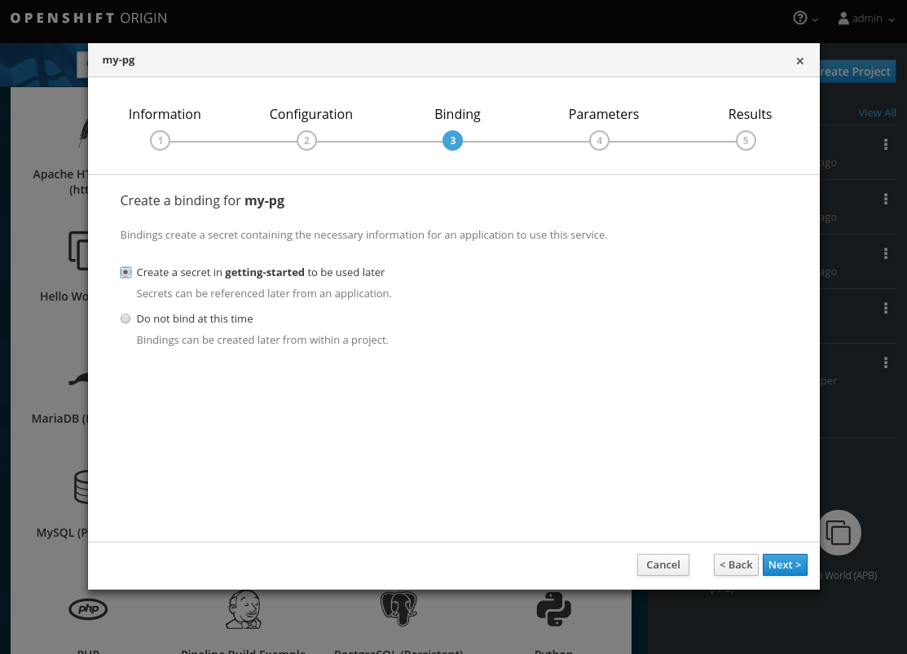
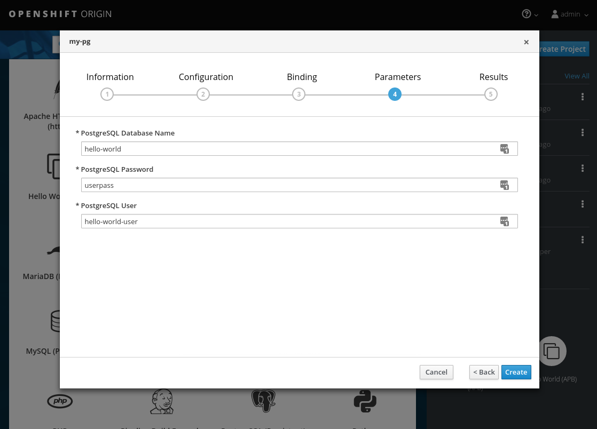
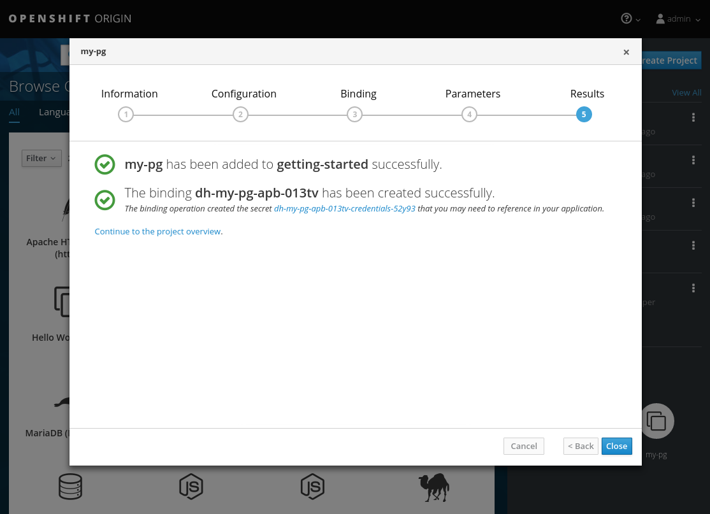

# Getting Started

1. [Introduction](#introduction-to-ansible-playbook-bundles-apbs)
1. [Development Environment](#development-environment)
1. [Creating Your First APB](#creating-your-first-apb)
    1. [Init](#using-apb-init)
    1. [Actions](#actions)
        * [Provision](#provision)
        * [Deprovision](#deprovision)
        * [Bind](#bind)
        * [Test](#test)
1. [Notes](#notes)
1. [More Information](#more-information)

## Introduction to Ansible Playbook Bundles (APBs)

In this tutorial, we'll walk through the creation of some sample APBs.  We will create actions for them to allow provision, deprovision, bind, and unbind.  You can find more information about the design of APBs in the [design doc](https://github.com/fusor/ansible-playbook-bundle/blob/master/docs/design.md).  More in-depth information about writing APBs is available in the [developers doc](developers.md)

*Note:  For the remainder of this tutorial, substitute your own information for items marked in brackets, for example `<host>:<port>` might need to be replaced with `172.17.0.1.nip.io:8443`.*

## Development Environment

Before getting started with APBs, we need to get your system set up to create them.

First, make sure your system is properly running [OpenShift Origin](https://www.openshift.org/).  You should be running both the service catalog and Ansible Service Broker (ASB). Instructions can be found on the ASB [getting started doc](https://github.com/openshift/ansible-service-broker#getting-started-with-the-ansible-service-broker).

Next, install the APB tools as documented in the [APB CLI Tooling doc](https://github.com/fusor/ansible-playbook-bundle/blob/master/docs/apb_cli.md#installing-the-apb-tool).  To check, you can run `apb help` and check for a valid response.
```
$ apb help
usage: apb [-h] [--debug] [--project BASE_PATH]
           {init,help,prepare,push,bootstrap,list,remove,build} ...

APB tooling for assisting in building and packaging APBs.

optional arguments:
  -h, --help            show this help message and exit
  --debug               Enable debug output
  --project BASE_PATH, -p BASE_PATH
                        Specify a path to your project. Defaults to CWD.

subcommand:
  {init,help,prepare,push,bootstrap,list,remove,build}
    init                Initialize the directory for APB development
    help                Display this help message
    prepare             Prepare an ansible-container project for APB packaging
    push                Push local APB spec to an Ansible Service Broker
    bootstrap           Tell Ansible Service Broker to reload APBs from the
                        container repository
    list                List APBs from the target Ansible Service Broker
    remove              Remove APBs from the target Ansible Service Broker
    build               Build and package APB container

```

## Creating your first APB
In this tutorial, we'll create an APB for a containerized [hello world application](https://hub.docker.com/r/ansibleplaybookbundle/hello-world/).  We'll work through a basic APB that will mirror the [hello-world-apb](https://github.com/ansibleplaybookbundle/hello-world-apb).

### Using apb init
Our first task is to create the skeleton for your app using the apb tool.  The command for this is simple:
```bash
$ apb init my-test-apb
```
At this point you will see the following file structure
```
my-test-apb/
├── apb.yml
├── Dockerfile
├── playbooks
│   ├── deprovision.yml
│   └── provision.yml
└── roles
    ├── deprovision-my-test-apb
    │   └── tasks
    │       └── main.yml
    └── provision-my-test-apb
        └── tasks
            └── main.yml
```
Two files were created at the root directory, an `apb.yml` and a `Dockerfile`.  These are the minimum required for any APB.  For more information about the apb spec, visit the [developer doc](developers.md#apb-spec-file).  There is also an explanation of what we can do in the [Dockerfile](developers.md#dockerfile).
```yaml
# apb.yml
version: 1.0
name: my-test-apb
description: This is a sample application generated by apb init
bindable: False
async: optional
metadata:
  displayName: my-test
plans:
  - name: default
    description: This default plan deploys my-test-apb
    free: True
    metadata: {}
    parameters: []
```
```dockerfile
# Dockerfile
FROM ansibleplaybookbundle/apb-base

LABEL "com.redhat.apb.spec"=\

COPY playbooks /opt/apb/actions
COPY roles /opt/ansible/roles
RUN chmod -R g=u /opt/{ansible,apb}
USER apb
```

We now need to update the `com.redhat.apb.spec` LABEL with a base64 encoded version of apb.yml. To do this we need to run `apb prepare`
```bash
$ cd my-test-apb
$ apb prepare
```

```dockerfile
# Dockerfile
FROM ansibleplaybookbundle/apb-base

LABEL "com.redhat.apb.spec"=\
"dmVyc2lvbjogMS4wCm5hbWU6IG15LXRlc3QtYXBiCmRlc2NyaXB0aW9uOiBUaGlzIGlzIGEgc2Ft\
cGxlIGFwcGxpY2F0aW9uIGdlbmVyYXRlZCBieSBhcGIgaW5pdApiaW5kYWJsZTogRmFsc2UKYXN5\
bmM6IG9wdGlvbmFsCm1ldGFkYXRhOgogIGRpc3BsYXlOYW1lOiBteS10ZXN0CnBsYW5zOgogIC0g\
bmFtZTogZGVmYXVsdAogICAgZGVzY3JpcHRpb246IFRoaXMgZGVmYXVsdCBwbGFuIGRlcGxveXMg\
bXktdGVzdC1hcGIKICAgIGZyZWU6IFRydWUKICAgIG1ldGFkYXRhOiB7fQogICAgcGFyYW1ldGVy\
czogW10="

COPY playbooks /opt/apb/actions
COPY roles /opt/ansible/roles
RUN chmod -R g=u /opt/{ansible,apb}
USER apb
```

At this point we have a fully formed APB that we can build.  If you skipped the apb prepare, apb build will still prepare the apb before building the image. You can optionally specify the organization (ie. ansibleplaybookbundle) here.
```bash
$ apb build
```

At this point, you can push the new APB image to the local OpenShift registry.
```bash
$ apb push -o
```

Querying the ansible service broker will now show your new apb listed.
```bash
$ apb list
ID                                NAME            DESCRIPTION                                         
< ------------ ID ------------->  dh-my-test-apb  This is a sample application generated by apb init  
```

Visiting the OpenShift console UI will now display the new Ansible Playbook Bundle named my-test-apb in the catalog under the **_All_** tab and **_Other_** tab.

### Actions
The brand new APB created in the last section doesn't do very much.  For that, we'll have to add some actions.  The actions supported are [provision](#provision), [deprovision](#deprovision), [bind](#bind), [unbind](#unbind), and [test](#test).  We'll add each of these actions in the following sections.

Before we begin, make sure you're logged in through the command line.  This will insure the apb tool can interact with OpenShift and the Ansible Service Broker (ASB).
```
# substitute your information for <oc-cluster-host>:<oc-cluster-port>
oc login --insecure-skip-tls-verify <oc-cluster-host>:<oc-cluster-port> -u admin -p admin
```

You should also be able login (as admin/admin if you're using catasb) and see your APB listed in the web UI.


[TODO]: # (change the example yaml so that service/route/dc are all different names to explicitly show the relationships specified by selector, etc)

Before we go any further, create a project named `getting-started` for us to deploy resources.  You can create it in the web UI or from the command line.
```bash
oc new-project getting-started
```

#### Provision
During the `apb init` process 2 parts of the provision task were stubbed out.  The playbook, `playbooks/provision.yml`, and the associated role in `roles/provision-my-test-apb`.

```
my-test-apb
├── apb.yml
├── Dockerfile
├── playbooks
│   └── provision.yml     # inspect this playbook
└── roles
    └── provision-my-test-apb
        └── tasks
            └── main.yml  # edit this role
```
`playbooks/provision.yml` is the Ansible playbook that will be run when the **_provision_** action is called from the Ansible Service Broker.  You can change the playbook, but for now you can just leave the code as is.
```yaml
- name: my-test-apb playbook to provision the application
  hosts: localhost
  gather_facts: false
  connection: local
  roles:
  - role: ansible.kubernetes-modules
    install_python_requirements: no
  - role: ansibleplaybookbundle.asb-modules
  - role: provision-my-test-apb
    playbook_debug: false
```

`provision.yml` is a new Ansible playbook which will execute on `localhost` and execute the role `provision-my-test-apb`.  This playbook works on it's local container created by the service broker.  The `ansible.kubernetes-modules` role will allow us to use the [kubernetes-modules](https://github.com/ansible/ansible-kubernetes-modules) to create our OpenShift resources.  The [asb-modules](https://github.com/fusor/ansible-asb-modules) provide some additional functionality for use with the Ansible Service Broker.

Currently, there are no tasks in the role.  The contents of file `roles/provision-my-test-apb/tasks/main.yml`  only contains comments showing common resource creation tasks.  You can currently execute the provision task, but since there are no tasks to perform, it would simply launch the APB container and exit without deploying anything.

Feel free to try this now by clicking on the **my-test** APB and deploying it to the **getting-started** project using the wizard.


If you look carefully, when the provision is executing, a new namespace was created with the name `dh-my-test-apb-prov-<random>`.  In development mode, it will persist, but usually this namespace would be deleted after successful completion.  By looking at the pod resources, you can see the log for the execution of the APB.  In order to find these namespaces you can view all namespaces and sort by creation date or use `oc get ns`.

```bash
$ oc get ns
NAME                                STATUS    AGE
ansible-service-broker              Active    1h
default                             Active    1h
dh-my-test-apb-prov-<random>        Active    4m
...

$ oc project dh-my-test-apb-prov-<random>
Now using project "dh-my-test-apb-prov-<random>" on server "<oc-cluster-host>:<oc-cluster-port>".

$ oc get pods
NAME             READY     STATUS      RESTARTS   AGE
<apb-pod-name>   0/1       Completed   0          3m

$ oc logs -f <apb-pod-name>
...
+ ansible-playbook /opt/apb/actions/provision.yml --extra-vars '{"_apb_plan_id":"default","namespace":"getting-started"}'
PLAY [my-test-apb playbook to provision the application] ***********************
TASK [ansible.kubernetes-modules : Install latest openshift client] *************
skipping: [localhost]
TASK [ansibleplaybookbundle.asb-modules : debug] *******************************
skipping: [localhost]
PLAY RECAP *********************************************************************
localhost                  : ok=0    changed=0    unreachable=0    failed=0
```

##### Provision - Creating a deployment config
At the minimum, our APB should deploy the application [pods](https://docs.openshift.org/latest/architecture/core_concepts/pods_and_services.html#pods).  We'll do this by specifying a [deployment config](https://docs.openshift.org/latest/architecture/core_concepts/deployments.html#deployments-and-deployment-configurations).  One of the first tasks that's commented out on the in the `provision-my-test-apb/tasks/main.yml` is the creation of the deployment config.  You can uncomment it or paste the following.  Normally, you would replace the `image:` value with your own application image and
```yaml
- name: create deployment config
  openshift_v1_deployment_config:
    name: my-test
    namespace: '{{ namespace }}'
    labels:
      app: my-test
      service: my-test
    replicas: 1
    selector:
      app: my-test
      service: my-test
    spec_template_metadata_labels:
      app: my-test
      service: my-test
    containers:
    - env:
      image: docker.io/ansibleplaybookbundle/hello-world:latest # replace with your application image
      name: my-test
      ports:
      - container_port: 8080
        protocol: TCP
```
The `namespace` field will designate which [namespace](https://docs.openshift.org/latest/architecture/core_concepts/projects_and_users.html#namespaces) the deployment config should be in.

The [`labels`] are used to help us organize, group, and select objects.

The `replicas: 1` field specifies that we only want 1 [pod](https://docs.openshift.org/latest/architecture/core_concepts/pods_and_services.html#pods).

The `selector` section is a [label](https://docs.openshift.org/latest/architecture/core_concepts/pods_and_services.html#labels) query over pods.

In the `containers` section, we have specified the a [container](https://docs.openshift.org/latest/architecture/core_concepts/containers_and_images.html#containers) with a hello-world app running on port 8080 on TCP.  The [image](https://docs.openshift.org/latest/architecture/core_concepts/containers_and_images.html#docker-images) is stored on [docker.io](https://hub.docker.com/)/[ansibleplaybookbundle](https://hub.docker.com/r/ansibleplaybookbundle/)/[hello-world](https://hub.docker.com/r/ansibleplaybookbundle/hello-world/).

For more information, the [developers guide](developers.md#deployment-config) has more detail and you can also visit the ansible-kubernetes-modules [code](https://github.com/ansible/ansible-kubernetes-modules/blob/master/library/openshift_v1_deployment_config.py) documentation for a full accounting of all fields.


If you build, push, and provision the apb there will be a new running pod and a new deployment config.

Build and Push 
```
$ apb build
$ apb push -o
```
Provision using the Web Console UI

Check your resources
```
$ oc project getting-started
$ oc get all
NAME         REVISION   DESIRED   CURRENT   TRIGGERED BY
dc/my-test   1          1         1         config

NAME           DESIRED   CURRENT   READY     AGE
rc/my-test-1   1         1         1         35s

NAME                 READY     STATUS    RESTARTS   AGE
po/my-test-1-2pw4t   1/1       Running   0          33s
```
You will also be able to see the deployed application in the console UI at https://<oc-cluster-host>:<oc-cluster-port>/console/project/getting-started/overview.  The only way to use this pod currently is to use `oc describe pods/<pod-name>`, to find out it's IP address and access it directly.  If we had multiple pods, they'd be accessed separately.  To treat them like a single host, we'd need to create a **_service_**

To clean up before moving on and allow us to provision again, feel free to delete the getting-started namespace and recreate it or create a new one.

##### Provision - Creating a service
We want to use multiple [pods](https://docs.openshift.org/latest/architecture/core_concepts/pods_and_services.html#pods), load balance them, and create a [service](https://docs.openshift.org/latest/architecture/core_concepts/pods_and_services.html#services) so that a user can access them as a single host.  Let's create that service and modify the same `provision-my-test-apb/tasks/main.yml` by adding the following:
```yaml
- name: create my-test service
  k8s_v1_service:
    name: my-test
    namespace: '{{ namespace }}'
    labels:
      app: my-test
      service: my-test
    selector:
      app: my-test
      service: my-test
    ports:
      - name: web
        port: 80
        target_port: 8080
```
The `selector` will allow the *my-test* service to include the correct pods.  The `ports` will take the target port from the pods (8080) and expose them as a single port for the service (80).  Notice the application was running on 8080 but has now been made available on the default http port of 80.  The `name` field of the port will allow us to specify this port in the future with other resources.  More information is available in the [k8s_v1_service module](https://github.com/ansible/ansible-kubernetes-modules/blob/master/library/k8s_v1_service.py).

If you rebuild the APB with `apb build`, push it using `apb push -o`, and provision it, you will see a new service in the UI or on the command line.  In the UI (), you can click on the new service under **_Networking_** in the application on the overview page or under **_Applications -> Services_**.  The service's IP address will be shown which you can use to access the load balanced application.  To view the service information from the command line, you can do the following:
```
$ oc project getting-started
$ oc get services
$ oc describe services/my-test
```
The describe command will show the IP address to access the service. Using an IP address for users to access our application isn't generally what we want.  Generally, we want to create a [route](https://docs.openshift.org/latest/architecture/core_concepts/routes.html).

##### Provision - Creating a route
We want to expose external access to our application through a reliable named [route](https://docs.openshift.org/latest/architecture/core_concepts/routes.html).
```yaml
- name: create my-test route
  openshift_v1_route:
    name: my-test
    namespace: '{{ namespace }}'
    labels:
      app: my-test
      service: my-test
    to_name: my-test
    spec_port_target_port: web
```
The `to_name` is name of the target service.  `spec_port_target_port` refers to the name of the target service's port.  More information is available in the [openshift_v1_route module](https://github.com/ansible/ansible-kubernetes-modules/blob/master/library/openshift_v1_route.py).
If you rebuild the APB with `apb build`, push it using `apb push -o`, and provision it, it, you will see the new route created.  On the console UI overview page for the getting-started project, you will now see an active and clickable route link listed on the application.  Clicking on the route or visiting the URL will bring up the hello-world app.  From the command line, you can also view the route information.
```
$ oc project getting-started

$ oc get routes
NAME      HOST/PORT                                   PATH      SERVICES   PORT      TERMINATION   WILDCARD
my-test   my-test-getting-started.172.17.0.1.nip.io             my-test    web                     None

$ oc describe routes/my-test
Name:			my-test
Namespace:		getting-started
...
```

At this point, our my-test application is fully functional, load balanced, scalable, and accessible.  You can compare your finished APB to the hello-world APB at [apb-examples](https://github.com/fusor/apb-examples/tree/master/hello-world-apb).

#### Deprovision
In the deprovision task, we need to destroy all provisioned resources, usually in reverse order.

To add the deprovision action, we need a `deprovision.yml` inside the `playbooks` directory and tasks in `roles/deprovision-my-test-apb/tasks/main.yml`.  Both these files have been created for you, but like
```
my-test-apb/
├── apb.yml
├── Dockerfile
├── playbooks
│   └── provision.yml     # inspect this file
└── roles
    └── deprovision-my-test-apb
        └── tasks
            └── main.yml  # edit this file


```

You can look at the code `playbooks/deprovision.yml` which should look like:
```yaml
- name: my-test-apb playbook to deprovision the application
  hosts: localhost
  gather_facts: false
  connection: local
  roles:
  - role: ansible.kubernetes-modules
    install_python_requirements: no
  - role: ansibleplaybookbundle.asb-modules
  - role: deprovision-my-test-apb
    playbook_debug: false
```
The content looks the same as the provision task, except it's calling a different role.  Let's edit that role now in the file `roles/deprovision-my-test-apb/tasks/main.yml`.  By uncommenting the tasks, the resulting file without comments should look like the following:
```yaml
- openshift_v1_route:
    name: my-test
    namespace: '{{ namespace }}'
    state: absent

- k8s_v1_service:
    name: my-test
    namespace: '{{ namespace }}'
    state: absent

- openshift_v1_deployment_config:
    name: my-test
    namespace: '{{ namespace }}'
    state: absent
```
In `provision.yml`, created earlier, we created the deployment config, service, then route. For the **_deprovision_** action, we'll want to delete the resources in reverse order.  We do so by identifying the resource by `namespace` and `name` and then marking it as `state: absent`.

To run the deprovision template, click on the menu on the list of **_Deployed Services_** and select **_Delete_**.


#### Bind
From the previous sections, we learned how to deploy a standalone application.  However, in most cases applications will need to communicate other applications, often a data source.  In the following sections we'll create PostgreSQL database that the hello-world application deployed from my-test-apb can use.

##### IMPORTANT - Notes on async bind
Running the APB bind action and `bind_parameters` are __EXPERIMENTAL__ features. Currently, running bind returns encoded values from the provision action.  In order to use `bind_parameters` and execute the bind playbook, ASB must enable the feature using `LAUNCH_APB_ON_BIND=true`.  In catasb, this can be set in `my_vars.yml` using `broker_launch_apb_on_bind: "true"`

In addition, Kubernetes has not yet implemented [asynchronous binding](https://github.com/kubernetes-incubator/service-catalog/issues/1209), but it is expected in the near future.  Until then, if the binding is not created quickly, the request will time out with unexpected results.

This tutorial is based on the async bind version of [hello-world-db-app](https://github.com/ansibleplaybookbundle/hello-world-db-apb/tree/async-bind).

##### Bind - Prep
To give us a good starting point, we'll create the necessary files for provision and deprovisioning PostgreSQL. A more in-depth example can be found at the [APB example for Postgres](https://github.com/ansibleplaybookbundle/rhscl-postgresql-apb).

```
apb init my-pg-apb --bindable
```
This will create the normal APB file structure with a few differences.

```
my-pg-apb/
├── apb.yml                     # bindable flag set to true
├── Dockerfile
├── playbooks
│   ├── bind.yml                # new file
│   ├── deprovision.yml
│   ├── provision.yml
│   └── unbind.yml              # new file
└── roles
    ├── bind-my-pg-apb
    │   └── tasks
    │       └── main.yml        # add binding tasks, encode user credentials
    ├── deprovision-my-pg-apb
    │   └── tasks
    │       └── main.yml
    ├── provision-my-pg-apb
    │   └── tasks
    │       └── main.yml        # encode admin credentials
    └── unbind-my-pg-apb
        └── tasks
            └── main.yml        # cleanup objects creating in binding
```

In addition to the normal files, new playbooks `bind.yml`, `unbind.yml`, and their associated roles have been stubbed out.  `bind.yml` and `unbind.yml` are both empty.  We'll use those files to perform any actions we want to execute when creating the binding and return bind credentials in a secret.

 Edit the `apb.yml`.  Notice the setting `bindable: true`.  In addition to those changes, we need to add some parameters to the apb.yml for configuring PostgreSQL.  They will be available fields in the GUI when provisioning our new APB.
```yaml
version: 1.0
name: my-pg-apb
description: This is a sample application generated by apb init
bindable: True
async: optional
metadata:
  displayName: my-pg
plans:
  - name: default
    description: This default plan deploys my-pg-apb
    free: True
    metadata: {}
    # edit the parameters and add the ones below.
    # parameters will be usable in the provision action
    parameters:
      - name: postgresql_admin_password
        title: PostgreSQL Admin Password
        type: string
        required: true
    # bind_parameters will be usabled in the bind action
    bind_parameters:
      - name: postgresql_db_name
        title: PostgreSQL Database Name
        type: string
        required: true
        default: hello-world
      - name: postgresql_user
        title: PostgreSQL User
        type: string
        required: true
        default: hello-world-user
      - name: postgresql_password
        title: PostgreSQL Password
        type: string
        required: true
```

In the `Dockerfile`, we'll need to add `RUN yum -y install postgresql-libs python-psycopg2 && yum clean all` in order to install some packages for the ansible postgres modules to work.  It should look like:

```Dockerfile
FROM ansibleplaybookbundle/apb-base

LABEL "com.redhat.apb.spec"=\
"<----------------------Long-Base64-Encoded-String--------------------------\
----------------------------------------------------------------------------\
----------------------->"

# Add the following line to install packages 
# we'll need for ansible to interact with Postgres
RUN yum -y install postgresql-libs python-psycopg2 && yum clean all


COPY playbooks /opt/apb/actions
COPY roles /opt/ansible/roles
RUN chmod -R g=u /opt/{ansible,apb}
USER apb
```

The `playbooks/provision.yml` will look like the following:
```yaml
- name: my-pg-apb playbook to provision the application
  hosts: localhost
  gather_facts: false
  connection: local
  roles:
  - role: ansible.kubernetes-modules
    install_python_requirements: no
  - role: ansibleplaybookbundle.asb-modules
  - role: provision-my-pg-apb
    playbook_debug: false

```
The `playbooks/deprovision.yml` will look like the following:
```yaml
- name: my-pg-apb playbook to deprovision the application
  hosts: localhost
  gather_facts: false
  connection: local
  roles:
  - role: ansible.kubernetes-modules
    install_python_requirements: no
  - role: deprovision-my-pg-apb
    playbook_debug: false
```
Edit the `roles/provision-my-pg-apb/tasks/main.yml`.  This mirrors our hello-world application in many respects but adds a [persistent volume](https://docs.openshift.org/latest/architecture/additional_concepts/storage.html#persistent-volume-claims) to save data between restarts and various configuration options for the deployment config.

In addition a new task has been added at the the very bottom after the provision tasks.  To save the credentials created during the provision process, we need to encode them for retrieval by the Ansible Service Broker. The new task, using the module `asb_encode_binding` will do so for us.  Here's where's we'll put the Postgres admin password (`DB_ADMIN_PASSWORD`)for later use to create databases, users, and privileges.

You can safely delete everything in that file and replace it with the following:
```yaml
# New persistent volume claim
- name: create volumes
  k8s_v1_persistent_volume_claim:
    name: my-pg
    namespace: '{{ namespace }}'
    state: present
    access_modes:
      - ReadWriteOnce
    resources_requests:
      storage: 1Gi

- name: create deployment config
  openshift_v1_deployment_config:
    name: my-pg
    namespace: '{{ namespace }}'
    labels:
      app: my-pg
      service: my-pg
    replicas: 1
    selector:
      app: my-pg
      service: my-pg
    spec_template_metadata_labels:
      app: my-pg
      service: my-pg
    containers:
    - env:
      - name: POSTGRESQL_ADMIN_PASSWORD
        value: '{{ postgresql_admin_password }}'
      image: docker.io/centos/postgresql-95-centos7
      name: my-pg
      ports:
      - container_port: 5432
        protocol: TCP
      termination_message_path: /dev/termination-log
      volume_mounts:
      - mount_path: /var/lib/pgsql/data
        name: my-pg
      working_dir: /
    volumes:
    - name: my-pg
      persistent_volume_claim:
        claim_name: my-pg
      test: false
      triggers:
      - type: ConfigChange

- name: create service
  k8s_v1_service:
    name: my-pg
    namespace: '{{ namespace }}'
    state: present
    labels:
      app: my-pg
      service: my-pg
    selector:
      app: my-pg
      service: my-pg
    ports:
    - name: port-5432
      port: 5432
      protocol: TCP
      target_port: 5432

# New encoding task makes admin credentials available to future bind operations
- name: encode bind credentials
  asb_encode_binding:
    fields:
      DB_TYPE: postgres
      DB_HOST: my-pg
      DB_PORT: "5432"
      DB_ADMIN_USER: postgres
      DB_ADMIN_PASSWORD: "{{ postgresql_admin_password }}"
```
The *encode bind credentials* task will make available several fields (`DB_TYPE`, `DB_HOST`, `DB_PORT`, `DB_USER`, `DB_PASSWORD`, `DB_NAME`)available to future actions such as bind.  We'll need these credentials in order to perform database operations during those future actions.

Edit the `roles/deprovision-my-pg-apb/tasks/main.yml` and delete the created resources.

```yaml
- k8s_v1_service:
    name: my-pg
    namespace: '{{ namespace }}'
    state: absent

- openshift_v1_deployment_config:
    name: my-pg
    namespace: '{{ namespace }}'
    state: absent
    
- k8s_v1_persistent_volume_claim:
    name: my-pg
    namespace: '{{ namespace }}'
    state: absent
```

Now to the actual tasks we want run when doing bind and unbind.  

First, notice the use of the variables (`postgresql_db_name`, `postgresql_user`, `postgresql_password`) from the `bind_parameters` in the `apb.yml`.  

In the provision task, we stored the postgres admin credentials.  We'll use the admin login to create a database, create a user, and give the user privileges to that database.  The encoded fields (`DB_TYPE`, `DB_HOST`, `DB_PORT`, `DB_ADMIN_USER`, `DB_ADMIN_PASSWORD`) from provisioning are stored in a dictionary `_apb_provision_creds` for use in these tasks.  

The last task we'll perform is encode the new credentials (`DB_TYPE`, `DB_HOST`, `DB_PORT`, `DB_NAME`, `DB_USER`, `DB_PASSWORD`) for our applications to use.  In this way, we keep the admin credentials secret from applications and can revoke the new credentials without affecting other applications.  These credentials will also be saved for future use in the unbind action.

Edit the `roles/bind-my-pg-apb/tasks/main.yml` and add the following:
```yaml
- name: create database
  postgresql_db:
    name: "{{ postgresql_db_name }}"
    port: "{{ _apb_provision_creds.DB_PORT }}"
    login_host: "{{ _apb_provision_creds.DB_HOST }}.{{ namespace }}"
    login_user: "{{ _apb_provision_creds.DB_ADMIN_USER }}"
    login_password: "{{ _apb_provision_creds.DB_ADMIN_PASSWORD }}"

- name: create database user
  postgresql_user:
    db: "{{ postgresql_db_name }}"
    name: "{{ postgresql_user }}"
    password: "{{ postgresql_password }}"
    port: "{{ _apb_provision_creds.DB_PORT }}"
    login_host: "{{ _apb_provision_creds.DB_HOST }}.{{ namespace }}"
    login_user: "{{ _apb_provision_creds.DB_ADMIN_USER }}"
    login_password: "{{ _apb_provision_creds.DB_ADMIN_PASSWORD }}"
    encrypted: yes

- name: grant privileges on database
  postgresql_privs:
    db: "{{ postgresql_db_name }}"
    port: "{{ _apb_provision_creds.DB_PORT }}"
    role: "{{ postgresql_user }}"
    login_host: "{{ _apb_provision_creds.DB_HOST }}.{{ namespace }}"
    login_user: "{{ _apb_provision_creds.DB_ADMIN_USER }}"
    login_password: "{{ _apb_provision_creds.DB_ADMIN_PASSWORD }}"
    type: database
    privs: ALL

- name: encode bind credentials
  asb_encode_binding:
    fields:
      DB_TYPE: postgres
      DB_HOST: "{{ _apb_provision_creds.DB_HOST }}"
      DB_PORT: "{{ _apb_provision_creds.DB_PORT }}"
      DB_NAME: "{{ postgresql_db_name }}"
      DB_USER: "{{ postgresql_user }}"
      DB_PASSWORD: "{{ postgresql_password }}"
```

Upon unbinding, we want to undo the previous tasks.  In this case, the unbind is destructive and will destroy the user and database.  We have access to the credentials from provision and bind in the dictionaries `_apb_provision_creds` and `_apb_bind_creds`.  We need those for login access and to identify the database and user to be deleted.

Edit the `roles/bind-my-pg-apb/tasks/main.yml` and add the following:
```yaml
- name: delete privileges on database
  postgresql_privs:
    db: "{{ _apb_bind_creds.DB_NAME }}"
    port: "{{ _apb_provision_creds.DB_PORT }}"
    role: "{{ _apb_bind_creds.DB_USER }}"
    login_host: "{{ _apb_provision_creds.DB_HOST }}.{{ namespace }}"
    login_user: "{{ _apb_provision_creds.DB_ADMIN_USER }}"
    login_password: "{{ _apb_provision_creds.DB_ADMIN_PASSWORD }}"
    type: database
    privs: ALL
    state: absent

- name: delete database user
  postgresql_user:
    db: "{{ _apb_bind_creds.DB_NAME }}"
    name: "{{ _apb_bind_creds.DB_USER }}"
    port: "{{ _apb_provision_creds.DB_PORT }}"
    login_host: "{{ _apb_provision_creds.DB_HOST }}.{{ namespace }}"
    login_user: "{{ _apb_provision_creds.DB_ADMIN_USER }}"
    login_password: "{{ _apb_provision_creds.DB_ADMIN_PASSWORD }}"
    state: absent

- name: delete database
  postgresql_db:
    name: "{{ _apb_bind_creds.DB_NAME }}"
    port: "{{ _apb_provision_creds.DB_PORT }}"
    login_host: "{{ _apb_provision_creds.DB_HOST }}.{{ namespace }}"
    login_user: "{{ _apb_provision_creds.DB_ADMIN_USER }}"
    login_password: "{{ _apb_provision_creds.DB_ADMIN_PASSWORD }}"
    state: absent
```

When all this is complete, build and push your APB.
```bash
apb build
apb push -o
```

At this point, the APB can create a fully functional Postgres database on our cluster and create a new database for use by our application.  Let's test it out now.

##### Bind - Execute from the user interface
To test your app, we'll bind a hello-world app to the provisioned Postgres database.  You can use the application previously created in the **_provision_** section of this tutorial or you can use the [hello-world-apb](https://github.com/ansibleplaybookbundle/hello-world-apb). Provision `my-test-apb` first.  Then, we'll want to provision `my-pg-apb` and select the option to `Create a secret...`.








Now, if you have not already done so, navigate to the project, you can see both your hello-world application and your Postgres database.  If you did not select to create a binding at provision time, you can also do so here with the **_Create binding_** link.  

If you have created the binding, we need to add the secret created by the binding into the application.  First navigate to the secrets, Resources -> Secrets.


Now, we need to add the secret as environment variables.


After this addition, you can return to the overview.  The my-test application may be redeploying from the configuration change.  If so wait and click on the route to view the application.  At this point,  you will see the hello-world application has detected and connected to the my-pg database.


#### Test
The intention the [test action](proposals/testing.md) is to check that an APB passes a basic sanity check before publishing to the service catalog. This is not meant to be testing a live service. OpenShift provides the ability to test a live service using [liveness and readiness probes](https://docs.openshift.org/latest/dev_guide/application_health.html), which you can add when provisioning. 

To add the test action to your APB, you just need to create a test.yml in the playbooks directory like this.

```bash
my-apb/
├── ...
├── playbooks/
    ├── test.yml  
    └── ...
```

The actual implementation of the test is left to you, the APB author. We have added some features to help with the implementation of testing. We have outlined an initial proposal of [best practices](proposals/testing_implementation), but as stated this still in flux, and encourage feedback on what works for you and what does not. 

##### APB Test
We have added a test command, `apb test` which can be used to run the test action. The test action will build the image, start up a pod as if you were being run by the service broker, and will retrieve the test results if any were saved. The status of pod after execution has finished will determine the status of the test. If the pod is in an error state, then something failed and we will tell you that the test was unsuccessful.

##### asb_save_test_result Module
`asb_save_test_result` [moudule](https://github.com/fusor/ansible-asb-modules) will allow you to save test results and allows the `apb test` command to return them. The APB pod will stay alive, for the tool to retrieve test results.
Example: 
```yaml
 - name: url check for media wiki
   uri:
     url: "http://{{ route.route.spec.host }}"
     return_content: yes
   register: webpage
   
  - name: Save failure for the web page
    asb_save_test_result:
      fail: true
      msg: "Could not reach route and retrieve a 200 status code. Recieved status - {{ webpage.status }}"
    when: webpage.status != 200
  
  - fail:
      msg: "Could not reach route and retrieve a 200 status code. Recieved status - {{ webpage.status }}"
    when: webpage.status != 200
  
  - name: Save test pass
    asb_save_test_result:
      fail: false
    when: webpage.status == 200
```

### Notes

#### Using `apb push` with Local OpenShift registry (recommended)
To test an APB you have built with the internal openshift registry, you can use `apb push -o`. This command takes the name of the OpenShift namespace you wish to push the image to. In order to use this feature, the Ansible Service Broker you are running must be configured to bootstrap from the local_openshift registry. Please see the [config file documentation](https://github.com/openshift/ansible-service-broker/blob/master/docs/config.md) to configure the registry for type `local_openshift`. The following command will build the image with the namespace you passed in as a parameter (by default `openshift`) and push it to the internal registry.

```
apb push --openshift
```
or 
```
apb push -o
```

#### Using `apb push` with Ansible Service Broker mock registry
To test an APB you have built without pushing your image to a registry, you can use `apb push`. This command takes the Ansible Service Broker's route as an argument and will push the base64 encoded spec into the list of available APBs for the Broker to deploy. In order to use this feature, the Ansible Service Broker you are running must be configured to run in development mode. In the [config file](https://github.com/openshift/ansible-service-broker/blob/master/etc/ex.dev.config.yaml#L21), set `devbroker` to `true`. This enables an endpoint to the broker at `/apb/spec` that a user can POST APBs to.

```
apb push [--broker <broker_route>]
```

You should now be able to see your APB in the service catalog.

#### Specifying Route for Broker
To get the route of the Ansible Service Broker in OpenShift:
```
oc project ansible-service-broker
oc get route
```

If you are running the Broker manually, you must include the Port as well as IP address the Broker is running.

### More information
* [Design](design.md) - overall design of Ansible Playbook Bundles
* [Developers](developers.md) - in-depth explanation of Ansible Playbook Bundles
* [APB CLI Tool](apb_cli.md) - installation and usage of the `apb` cli tool
* [OpenShift Origin Docs](https://docs.openshift.org/latest/welcome/index.html)
* The [ansible-kubernetes-modules](https://github.com/ansible/ansible-kubernetes-modules) project.
* [Example APBs](https://github.com/fusor/apb-examples)
* [Ansible Service Broker](https://github.com/openshift/ansible-service-broker)
